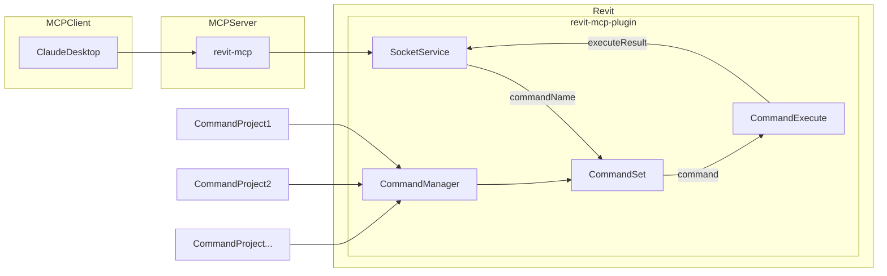

🔴

> [!WARNING]
> Deprecation notice, this repo is being archived in favour of the mono repo approch for the mcp https://github.com/mcp-servers-for-revit/mcp-servers-for-revit
> Simpler CI, less confusion for noobs, npm package and simpler install


---
---


[](https://mseep.ai/app/revit-mcp-revit-mcp)

# revit-mcp

English | [简体中文](README_zh.md)

## Description

revit-mcp allows you to interact with Revit using the MCP protocol through MCP-supported clients (such as Claude, Cline, etc.).

This project is the server side (providing Tools to AI), and you need to use [revit-mcp-plugin](https://github.com/revit-mcp/revit-mcp-plugin) (driving Revit) in conjunction.

Join [Discord](https://discord.gg/cGzUGurq) | [QQ Group](http://qm.qq.com/cgi-bin/qm/qr?_wv=1027&k=kLnQiFVtYBytHm7R58KFoocd3mzU_9DR&authKey=fyXDOBmXP7FMkXAWjddWZumblxKJH7ZycYyLp40At3t9%2FOfSZyVO7zyYgIROgSHF&noverify=0&group_code=792379482)

## Features

- Allow AI to get data from the Revit project
- Allow AI to drive Revit to create, modify, and delete elements
- Send AI-generated code to Revit to execute (may not be successful, successful rate is higher in some simple scenarios with clear requirements)

## Requirements

- nodejs 18+

> Complete installation environment still needs to consider the needs of revit-mcp-plugin, please refer to [revit-mcp-plugin](https://github.com/revit-mcp/revit-mcp-plugin)

## Installation

### 1. Build local MCP service

Install dependencies

```bash
npm install
```

Build

```bash
npm run build
```

### 2. Client configuration

**Claude client**

Claude client -> Settings > Developer > Edit Config > claude_desktop_config.json

```json
{
    "mcpServers": {
        "revit-mcp": {
            "command": "node",
            "args": ["<path to the built file>\\build\\index.js"]
        }
    }
}
```

Restart the Claude client. When you see the hammer icon, it means the connection to the MCP service is normal.


## Framework



## Supported Tools

| Name | Description |
| ---- | ----------- |
| get_current_view_info | Get current active view info |
| get_current_view_elements | Get elements from the current active view |
| get_available_family_types | Get available family types in current project |
| get_selected_elements | Get currently selected elements |
| get_material_quantities | Calculate material quantities and takeoffs |
| ai_element_filter | Intelligent element querying tool for AI assistants |
| analyze_model_statistics | Analyze model complexity with element counts |
| create_point_based_element | Create point-based elements (door, window, furniture) |
| create_line_based_element | Create line-based elements (wall, beam, pipe) |
| create_surface_based_element | Create surface-based elements (floor, ceiling, roof) |
| create_grid | Create a grid system with smart spacing generation |
| create_level | Create levels at specified elevations |
| create_room | Create and place rooms at specified locations |
| create_structural_framing_system | Create a structural beam framing system |
| delete_element | Delete elements by ID |
| operate_element | Operate on elements (select, setColor, hide, etc.) |
| color_elements | Color elements based on a parameter value |
| tag_all_walls | Tag all walls in the current view |
| tag_all_rooms | Tag all rooms in the current view |
| export_room_data | Export all room data from the project |
| store_project_data | Store project metadata in local database |
| store_room_data | Store room metadata in local database |
| query_stored_data | Query stored project and room data |
| send_code_to_revit | Send C# code to Revit to execute |
| say_hello | Display a greeting dialog in Revit (connection test) |
