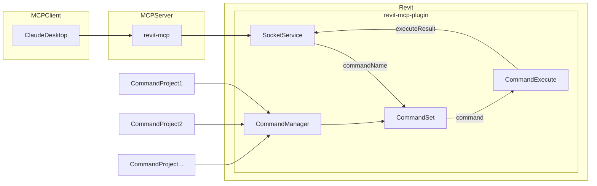

# revit-mcp

[English](README.md) | 简体中文

## 简介

revit-mcp 允许你通过支持mcp server的客户端（例如cladue、cline等）通过 MCP 协议与 Revit 进行交互。

本项目是服务端（向AI提供Tools），还需要配合[revit-mcp-plugin](https://github.com/revit-mcp/revit-mcp-plugin)（驱动Revit）使用。

加入我们 [Discord](https://discord.gg/cGzUGurq) | [QQ群](http://qm.qq.com/cgi-bin/qm/qr?_wv=1027&k=kLnQiFVtYBytHm7R58KFoocd3mzU_9DR&authKey=fyXDOBmXP7FMkXAWjddWZumblxKJH7ZycYyLp40At3t9%2FOfSZyVO7zyYgIROgSHF&noverify=0&group_code=792379482)

## 特性

- 允许AI获取Revit项目中的数据
- 允许AI驱动Revit创建、修改、删除元素
- 将AI生成的代码发送到Revit中执行（有可能不成功，在一些需求明确的简单场景下成功率较高）

## 环境要求

- nodejs 18+

> 完整的安装环境仍需考虑revit-mcp-plugin的需求，请参考[revit-mcp-plugin](https://github.com/revit-mcp/revit-mcp-plugin)

## 安装流程

### 1. 本地mcp服务构建

安装依赖

```bash
npm install
```

构建

```bash
npm run build
```

### 2. 客户端配置

**claude客户端**

Claude客户端->Settings > Developer > Edit Config > claude_desktop_config.json

``` json
{
    "mcpServers": {
        "revit-mcp": {
            "command": "node",
            "args": [
                "<替换为构件后的路径>\\build\\index.js"
            ]
        }
    }
}
```

重启Claude客户端，看到小锤子则正常连接到mcp服务


## 实现框架



## 支持的工具

| 名称 | 说明 |
| ---- | ---- |
| get_current_view_info | 获取当前活动视图信息 |
| get_current_view_elements | 获取当前活动视图中的元素 |
| get_available_family_types | 获取当前项目中可用的族类型 |
| get_selected_elements | 获取当前选中的元素 |
| get_material_quantities | 计算材料用量和工程量 |
| ai_element_filter | AI 智能元素查询工具 |
| analyze_model_statistics | 分析模型复杂度和元素统计 |
| create_point_based_element | 创建点式元素（门、窗、家具等） |
| create_line_based_element | 创建线式元素（墙、梁、管道等） |
| create_surface_based_element | 创建面状元素（楼板、天花板、屋顶等） |
| create_grid | 创建轴网系统 |
| create_level | 在指定标高创建楼层 |
| create_room | 在指定位置创建和放置房间 |
| create_structural_framing_system | 创建结构梁系统 |
| delete_element | 按 ID 删除元素 |
| operate_element | 操作元素（选择、设置颜色、隐藏等） |
| color_elements | 基于参数值对元素进行着色 |
| tag_all_walls | 标注当前视图中的所有墙体 |
| tag_all_rooms | 标注当前视图中的所有房间 |
| export_room_data | 导出项目中的所有房间数据 |
| store_project_data | 将项目元数据存储到本地数据库 |
| store_room_data | 将房间元数据存储到本地数据库 |
| query_stored_data | 查询已存储的项目和房间数据 |
| send_code_to_revit | 发送 C# 代码到 Revit 中执行 |
| say_hello | 在 Revit 中显示问候对话框（连接测试） |

